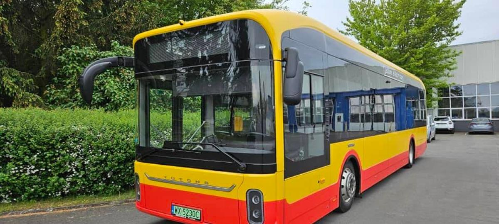

# Team
1. Bartłomiej Wysokiński (8B4art3ek) zadania 1, 6
2. Wojciech Soboń (Agraminis) zadania 4, 5
3. Aleksander Śpiewak (olektrol) zadania 2, 3

# INTRODUCTION
Miejskie Przedsiębiorstwo Komunikacyjne w Krakowie zostało spółką akcyjną w styczniu 1997 roku i jest spółką zależną Krakowskiego Holdingu Komunalnego SA. 

Pierwotnie przedsiębiorstwo było spółką z ograniczoną odpowiedzialnością, powstałą w 1990 roku z przekształcenia przedsiębiorstwa państwowego Miejskie Przedsiębiorstwo Komunikacyjne w Krakowie. Nowa spółka zajęła się organizacją transportu zbiorowego na terenie Krakowa oraz sąsiednich gmin. 

Od 1 sierpnia 2006 roku komunikacja miejska w Krakowie funkcjonuje na zupełnie innych zasadach, w których rozdzielona jest rola organizatora od przewoźników, a MPK SA w Krakowie stało się przewoźnikiem, przekazując kompetencje organizacyjne do nowo utworzonego Zarządu Dróg i Transportu, zastąpionego później przez Zarząd Infrastruktury Komunalnej i Transportu, który 1 listopada 2018 został zastąpiony przez Zarząd Transportu Publicznego w Krakowie.

# DATA
Bilety w Krakowie są bardzo drogie. Nikt ich nie kupuje, wszyscy jeżdżą na gape.

| Nazwa biletu | Cena normalny | Cena ulgowy | Ważność | 
| :---: | :---: | :---: | :---: | 
| 20-minutowy | 4.00 zł | 2.00 zł | 20 minut | 
| 60-minutowy | 6.00 zł | 3.00 zł | 60 minut | 
| Miesięczny | 148.00 zł | 74.00 zł | 30 dni |

